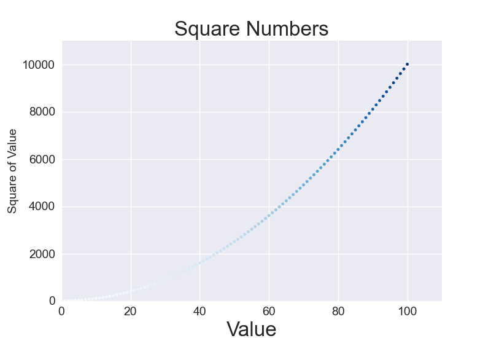

# Data-Visualization

# Squares
Used Framework: **Matplotlib**

Overview:
User input values and squares, program visualise it.

# Scatter Squares
Used Framework: **Matplotlib**

Overview:
Generating of X values and their Squares, programm visualise it as scatters.

# Dice
Used Framework: **Plotly**

Overview:
Using the python Random module, toss two dice with 6 and 10 edges 50000 times, visualize the result

[Result of Rolling](img/d6_d10.html)

# Random Walk
Used Framework: **Matplotlib**

Overview:
Using the python Random module, lining 5_000_000 random scatters.

# Weather
Used Framework: **Matplotlib**

Overview:
Weather of Death Valley, Sitka for 2018, and Moscow for 2020-2021.

